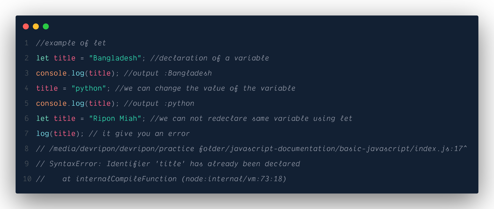
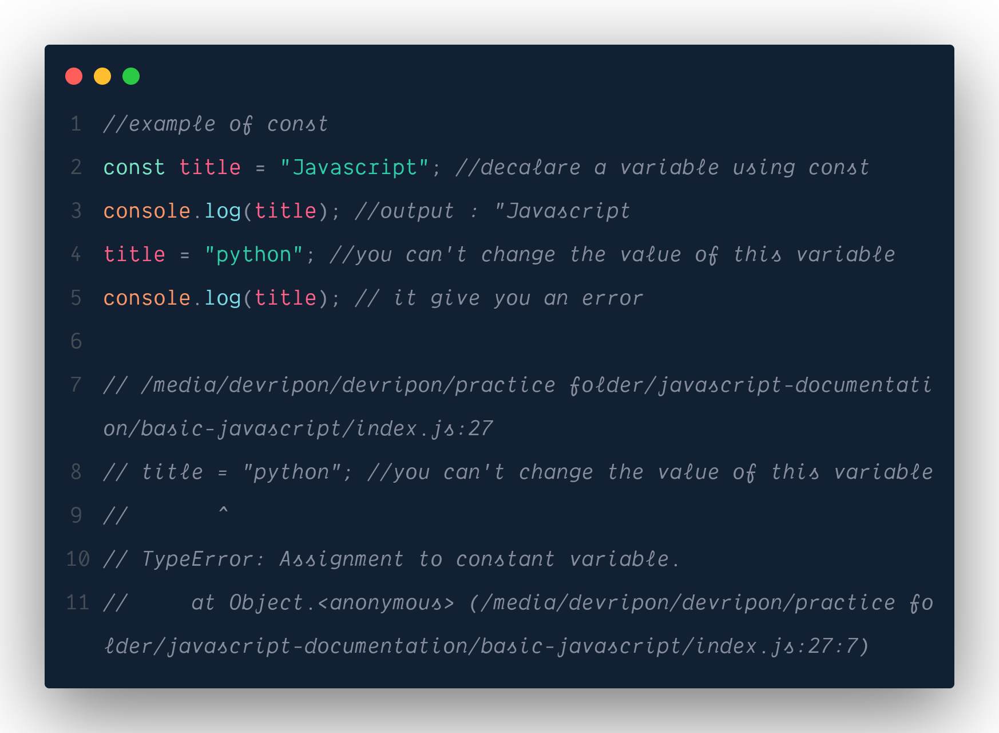

<h1 style="margin:auto;text-align:center;color:salmon;text-decoration:underline;line-height:30px;letter-spacing:1px;">Javascript Documentation</h1>
<h6> In This Documentaion I will try to cover all the topics of javascript,and will try to give details explanation</h6>

## Table of Contents

- [Table of Contents](#table-of-contents)
- [JavaScript Variables](#javascript-variables)
    - [var](#var)
    - [let](#let)
    - [const](#const)
- [Javascript Operators](#javascript-operators)
    - [Arithmetic Operators](#arithmetic-operators)
    - [Assignment Operators](#assignment-operators)
    - [Comparison Operators](#comparison-operators)
    - [String Operators](#string-operators)
    - [Logical Operators](#logical-operators)
    - [Bitwise Operators](#bitwise-operators)
    - [Ternary Operators](#ternary-operators)
    - [Type Operators](#type-operators)
    - [Addition Operators](#addition-operators)
- [Data Types](#data-types)
    - [String](#string)
    - [Number](#number)
    - [Boolean](#boolean)
    - [Bigint](#bigint)
    - [Undefined](#undefined)
    - [Null](#null)
    - [Symbol](#symbol)
    - [Object](#object)
- [Javascript Functions](#javascript-functions)
    - [Function Declarations](#function-declarations)
      - [Function definations](#function-definations)
      - [Function Invocation](#function-invocation)
    - [Function Expressions](#function-expressions)
    - [Arrow Functions](#arrow-functions)
      - [Syntax](#syntax)
        - [Shorthand](#shorthand)
      - [Arguments \& Parameters](#arguments--parameters)
    - [Contstructor Functions](#contstructor-functions)
      - [Properties](#properties)
      - [Methods](#methods)
    - [Higher Order Function](#higher-order-function)
    - [Function Closure](#function-closure)
    - [Callback Function](#callback-function)
    - [IIFE(immedieately invoked function expression) or Self invoked Function](#iifeimmedieately-invoked-function-expression-or-self-invoked-function)
    - [Function call() Method](#function-call-method)
    - [Function Apply() Method](#function-apply-method)
    - [Function bind() Method](#function-bind-method)

## JavaScript Variables

Variables are Containers for Storing Data JavaScript Variables can be declared in 3 ways:

#### var

The var keyword was used in all JavaScript code from 1995 to 2015. Var is a function scope
variable.we will discuss later about scope.var variables can change and redeclare. and var also a
window variable which is hoisted. we will discuss later about window and hoisting. lets see some
examples: 

#### let

The let and const keywords were added to JavaScript in 2015 or es6 release. You can not redaclare
the variable which is already declared using let keyword, but you can change the value of the
variable examples: 

#### const

The let and const keywords were added to JavaScript in 2015 or es6 release. You can not redaclare or
modify values which is already declared using const. examples: 

## Javascript Operators

There are different types of JavaScript operators:

#### Arithmetic Operators

arithmatic operator are used to complete the mathmatical calculation on javascript. Example of
Arithmetic Operators

-   (+) Addition
-   (-) Subtraction
-   (\*) Multiplication
-   (\*\*) Exponentiation (ES2016)
-   (/) Division
-   (%) Modulus (Division Remainder)
-   (++) Increment
-   (--) Decrement

#### Assignment Operators

Assignment operators are used to assign values to different variables

-   (=) Assignment operator

#### Comparison Operators

Comparison operators are used to compare values to different values examples: operator- description

-   (== ) equal to
-   (===) equal value and equal type
-   (!= ) not equal
-   (!==) not equal value or not equal type
-   (> ) greater than
-   (< )less than
-   (> =) greater than or equal to
-   (<=) less than or equal to
-   (?) ternary operator

#### String Operators

Javascript string operator are used to concate multiple strings into a single string, its called
concatenation operator. example:

-   (+) string operator or concatenation operator

#### Logical Operators

Javascript logical operator are used to implement logical operations. example logical operator:

-   (&& ) logical and
-   (|| ) logical or
-   (!) logical not

#### Bitwise Operators

Bit operators work on 32 bits numbers.

Any numeric operand in the operation is converted into a 32 bit number. The result is converted back
to a JavaScript number. It usually works on Machine or type writer machines exapmles:

-   (&) AND
-   (|) OR
-   (~) NOT
-   (^) XOR
-   (<<)left shift
-   (>>) right shift
-   ( >>>) unsigned right shift

#### Ternary Operators

Ternery operator are used to shorthand the logic

-   (? : ) Ternary operator

#### Type Operators

Type Operators are used to check the type of values

-   (typeof() ) Type Operator

#### Addition Operators

-   (=) use as x = y same as x = y
-   (+=) use as x += y same as x = x + y
-   (-=) use as x -= y same as x = x - y
-   (_=) use as x _= y same as x = x \* y
-   (/=) use as x /= y same as x = x / y
-   (%=) use as x %= y same as x = x % y
-   (**=) use as x **= y same as x = x \*\* y

## Data Types

JavaScript has 8 Datatypes

#### String

Any text type data is represent as a string Type Data

```JavaScript
    const str1 = "Hello world" // This is a String Type Data
```

#### Number

Any mathmatical number type data is represent as a Number Type Data

```JavaScript
    const num1 = 123 // This is a Number Type Data
```

#### Boolean

Any True or false value is represent as a Boolean Type Data

```JavaScript
    const agreed = true // This is a Boolean Type Data
```

#### Bigint

All JavaScript numbers are stored in a a 64-bit floating-point format.

JavaScript BigInt is a new datatype (ES2020) that can be used to store integer values that are too
big to be represented by a normal JavaScript Number.

```JavaScript
    const num = BigInt("0123456789034567854") // This is a Bigint Type Data
```

#### Undefined

In JavaScript, a variable without a value, has the value undefined. The type is also undefined.

```JavaScript
    const car;
    console.log(car);// output : undefined // and type also undefined

```

#### Null

In JavaScript, when set a variables value Null, then its value Null and The type is also Null.

```JavaScript
    const car = null;
    console.log(car);// output : null // and type also null

```

#### Symbol

symbol data type is a ECMAScript 2020 Feature

#### Object

Object data type contain various item like:

1. An object
2. An array
3. A date
4. A Constructor
5. A class
6. A function
7. A Math

In fact maximum this of javascript is object.

## Javascript Functions

A JavaScript function is a block of code designed to perform a particular task.

A JavaScript function is executed when "something" invokes it (calls it).

Why Functions?

With functions you can reuse code

You can write code that can be used many times.

You can use the same code with different arguments, to produce different results.

Javascript Functions are various types:

#### Function Declarations

Function declarations are primarily used to create a function. this type of functions are hoisted to
window object. that's why you can able to invoke (call a function) a function before the function
define.

##### Function definations

functions are defined with the `function` keyword. ts call function definition. after define a
function you can use it by invoke multiple times, when you want to use this function.

```JavaScript
// this is function definition / or function body
    function myFunction(){
        console.log("Hello My Name Is Ripon Miah");
    }

```

##### Function Invocation

After define a function you can use multiple time by Invoke the function. Invoke means call the
function. after function name just use `()` to invoke the function

```JavaScript
//invoke myFunction to get output
    myFunction()
// Output : Hello My Name Is Ripon Miah

```

You can invoke the function before define in this declaration type function

#### Function Expressions

functions are stored in a variable at Function Expression type

```javascript
// this is functions expression
const myFunction = function () {
    console.log("Hello JavaScript Developers");
};

myFunction(); // Output : Hello JavaScript Developers
```

You can not invoke function before define in this Expression type functions. It Can be called as
first class function

#### Arrow Functions

Arrow function is a ES6 feature of JavaScript.

##### Syntax

```JavaScript
    // Arrow Function Syntax
    const myArrowFunction = () => {
        console.log("Hello, I'm From Arrow Function");
    }

    myArrowFunction(); // Output : Hello, I'm From Arrow Function
```

You can not invoke function before define in this Arrow type functions.

###### Shorthand

If function have a single parameter then you can use this shorthand

```JavaScript
    const myShortArrowFunc = name => {
    console.log("hello world");
    }
    myShortArrowFunc();// Output : "hello world"
```

If function have a single line statement then you can use this shorthand

```javascript
const myShortArrowFunc = () => 10 + 20;
myShortArrowFunc(); // Output : 30
```

##### Arguments & Parameters

We can receive various data as argument to make more efficient use of the functions provided and we
can pass dynamic data to the functions as a parameter

example:

```JavaScript
/*
 * in below line we take two argument named
    name and skill to use dynamically in function like below .
    this is arguments
*/
const myFunc = (name , skill) => {
    console.log("Hello ! my name is " + name+" and I am " + skill);
}

//this are the variables we can pass as a parameter
let name = "Ripon Miah";
let skill = "Mern Stack Developer";

// here we can pass the parameters as a parameter when we invoke function
myfunc(name, skill); // Output : Hello ! my name is Ripon Miah and I am Mern Stack Developer
```

#### Contstructor Functions

##### Properties

##### Methods

#### Higher Order Function

#### Function Closure

#### Callback Function

#### IIFE(immedieately invoked function expression) or Self invoked Function

#### Function call() Method

#### Function Apply() Method

#### Function bind() Method
